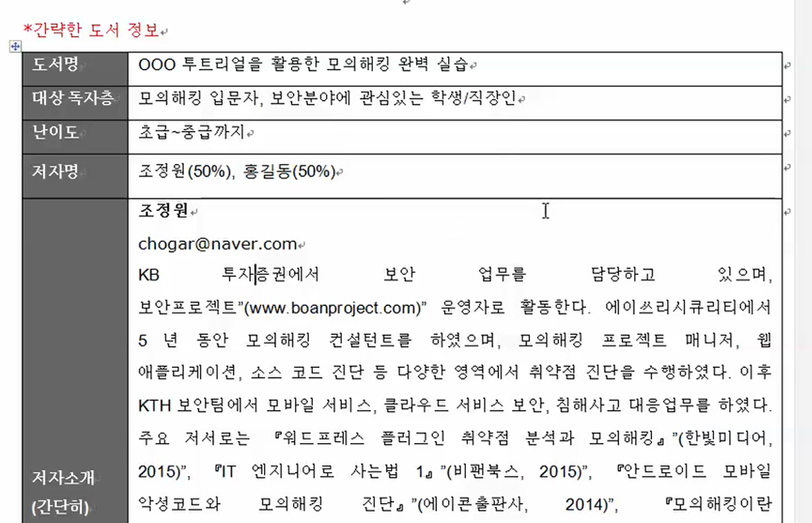
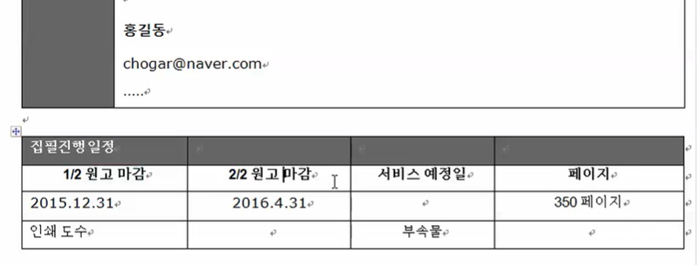
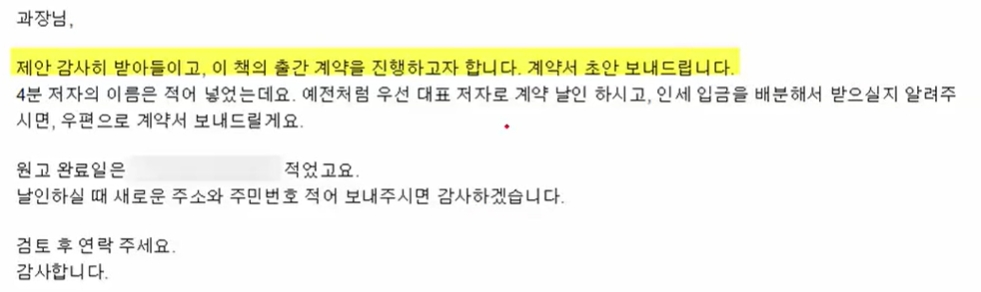
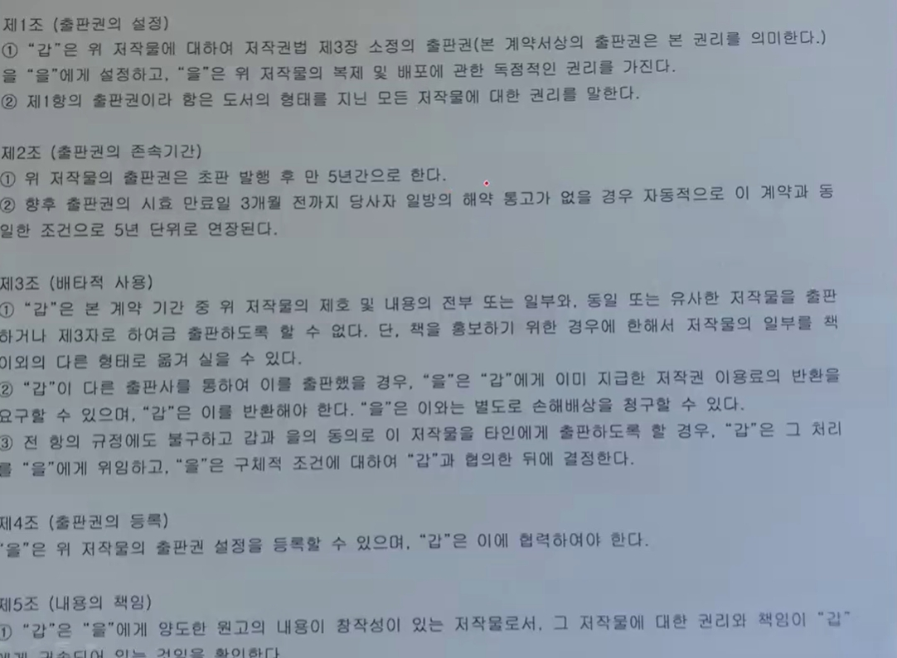
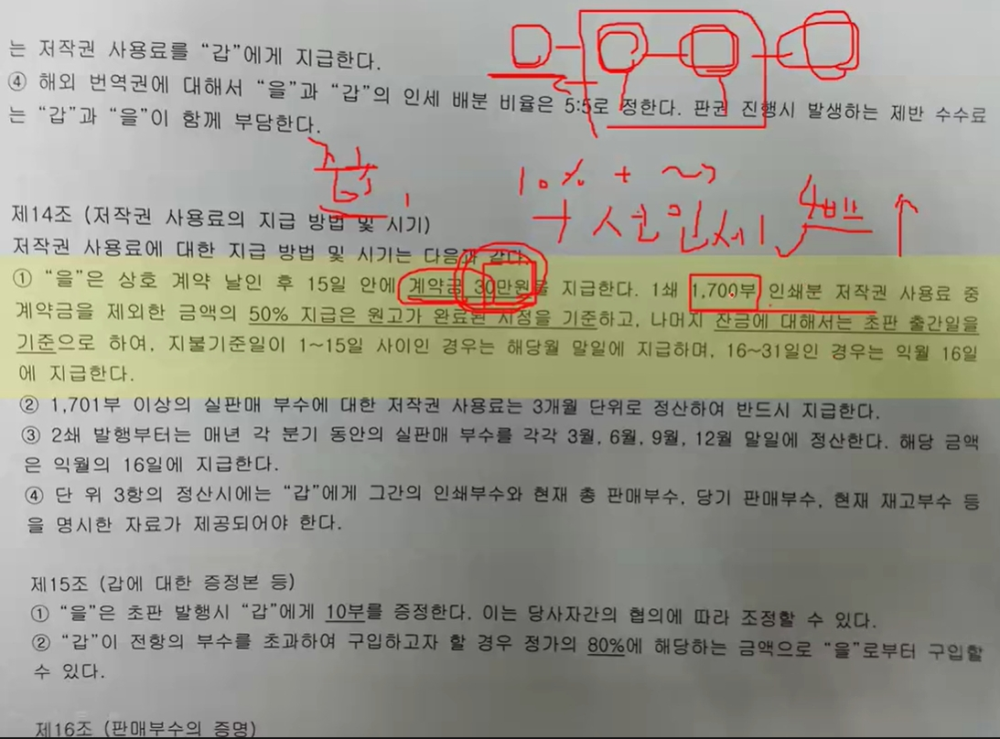
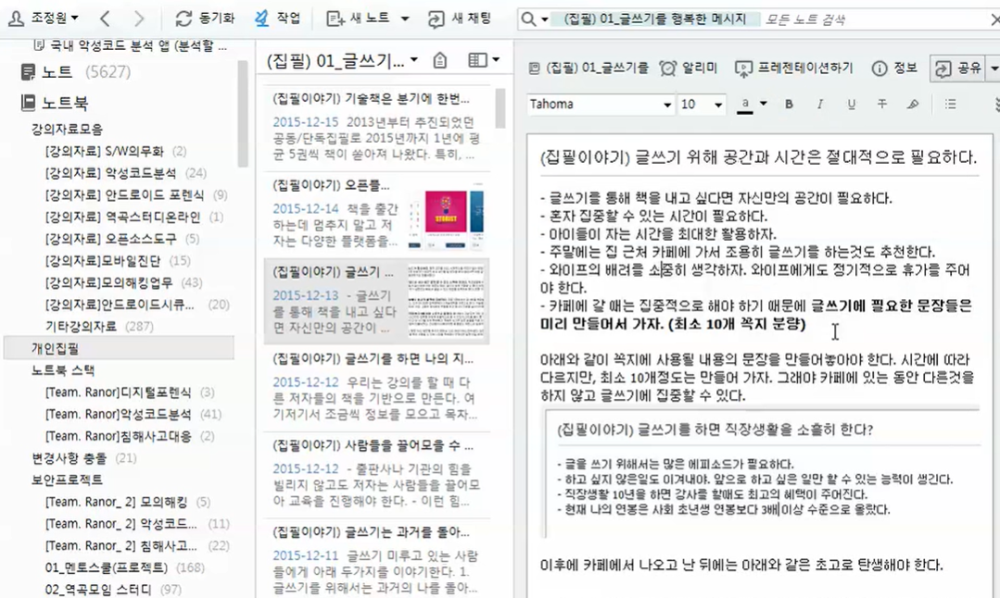
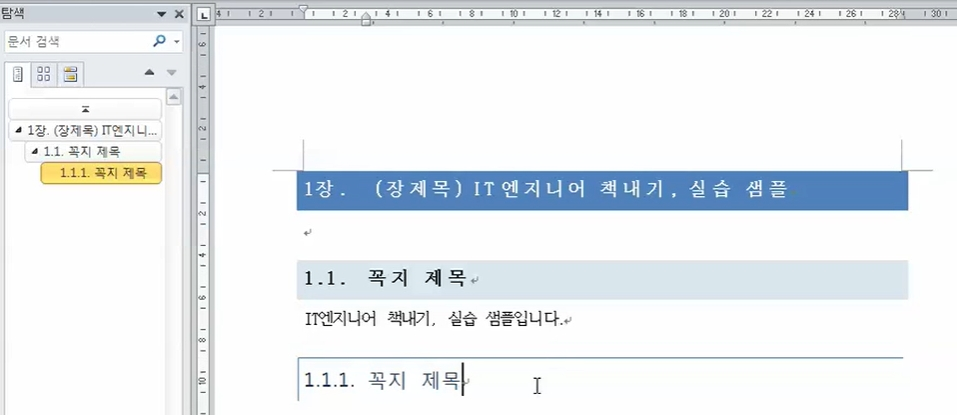
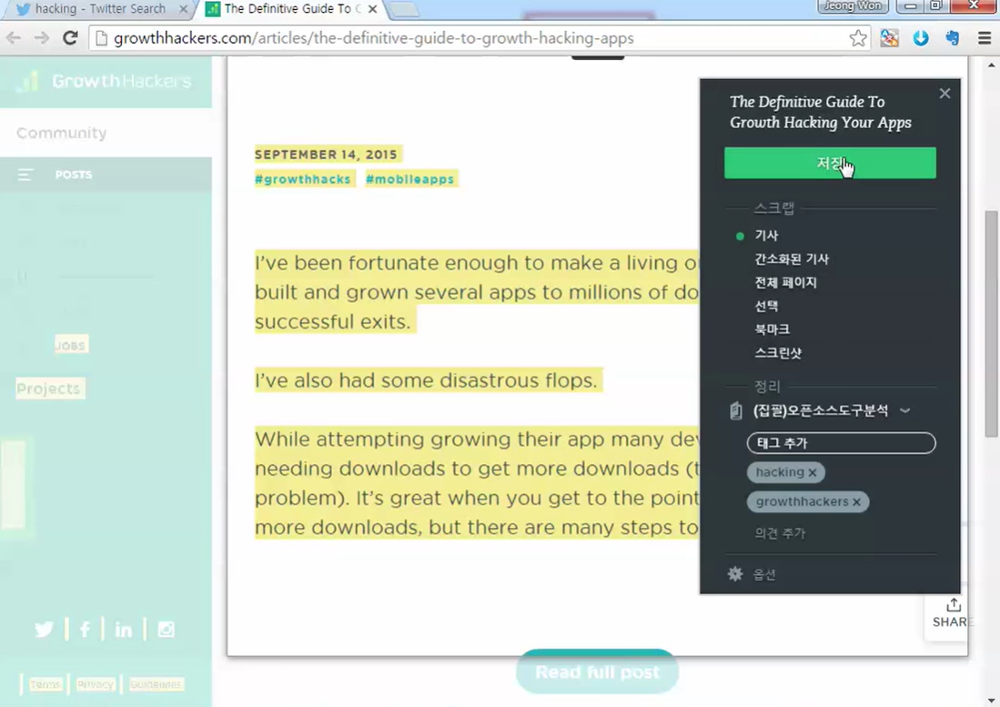

# 인프런 IT 직장인들을 위한 책쓰기 강의
* 강사 : 보안프로젝트
* 링크 : https://www.inflearn.com/course/%EC%A7%81%EC%9E%A5%EC%9D%B8%EB%93%A4%EC%9D%84-%EC%9C%84%ED%95%9C-%EC%B1%85%EC%93%B0%EA%B8%B0-%EA%B0%95%EC%9D%98

# 책을 쓸 때 마음 자세?
* 하루 A4용지 한 장이면 3달에 한 권 출판 가능

# 아이템은 한끗차이
* 너무 실무적이어선 안 된다.
    * 공감되는 내용 70% 깔고 새로 배울 수 있는 내용을 30% 넣어야 한다.
        * "이 단어는 들어봤다" 정도면 된다.

# 기획서 작성 단계 및 사례 분석
* 아이템을 선택했으면 첫 집필인 경우 기획서를 기반으로 짜면 좋다.

* 조정원(50%), 홍길동(50%) 처럼 수익배분도 미리 적어놔야 함.
* 원고 60% 정도 작성하고 기획서를 제안하면 계약에 유리함.
    * 계약이 되면 의욕이 생김.
    * 원고를 100% 다 썼는데 편집자 요청에 따라 구성을 전부 수정해야 하는 경우도 있음.
    * 그래서 초고 60%만 완성하고 계약을 권함.

# 출판사 계약 때 중요한점 및 사례 분석
* 
* 출판사는 기획서를 보고 시장조사를 진행하고 전문가에게 조언 받음.
* 탈고까지 일정 정하고 인세금액 합의 본다. 배분비율을 확실히 결정해야 한다.
* 약속을 줄이고 체력 관리를 시작해야 한다.
    * 흰머리, 탈모는 탈고 과정에서 겪는 사람이 꼭 있을 정도로 스트레스가 심하다.

* 
    * 계약서는 이렇게 생겼다.
    * **출판권은 저자 본인이 가진 것이다. 저자가 "갑"이다. 계약서에 언급되는 "갑"은 저자다.**
* 
    * 출판사마다 인세가 다르다.
    * 계약금과 선인세를 보통 한 번에 준다(위에 30만원처럼)
    * 계약금
        * 인세(보통 10%)가 계약금인 30만원을 넘으면, 그 넘은 차액만큼 분기마다 입금된다.
        * 즉 계약금 미리 많이 받으면 나중에 인세가 늦게 들어올 뿐이다.
    * 선인세
        * 위 계약서에선 1,700부 어치의 인세를 먼저 줄게요 라고 적혀 있다.
        * 이건 저자 입장에서 꽤 좋은 조건이다.
    * 외국 판매 시 인세
        * 이 경우 저자-출판사-서점에서 에이전시가 끼어 저자-출판사-에이전시-서점 의 형태가 된다.
        * 출판사와 에이전시가 돈 배분하고 남은 걸 인세로 주기 때문에 인세가 더 적을 수도 있다.
* 반드시 지켜야 할 것
    * 탈고 날짜(1차 원고, 2차 원고)를 꼭 지키자.
        * 10명 중 3~4명만 날짜를 지킨다고 한다. 안 지키면 계약이 파기되기도 한다.
        * 즉, 날짜만 잘 지켜도 꽤 좋은 평가를 받을 수가 있는 것이다.
        * 강사분도 한 달 정도 늦게 탈고한 경우가 있다고 한다.
    * 책이 나온 다음 홍보를 하자.
        * 카페/블로그/소셜네트워크 등 다양한 플랫폼 활용
        * 교육 강의를 하는 게 최고의 홍보다.
            * 강의 한 번 뛰니까 120권 더 팔리기도 했음.
        * **출판사가 아니라 자기가 광고를 해야 한다.**
    * 개정판을 미리 고민하자.
        * 2000부 이상 팔 것이라는 믿음을 가지자.
        * 2년 이내 개정판 출간이 되어야 함.

# 집필 방법 소개 (상세실습은 뒷편에)
* 집필
    * 출판사 양식에 맞추기(보통 doc파일)
    * 하루 A4용지 1장 이상
    * 스마트 기기와 클라우드 서비스를 최대한 활용
        * 
        * 에버노트, 드랍박스

# 교정/교열/출간 단계
* 교정/교열 단계 : 그림/표 레벨, 상호참조를 꼭 지키자.
    * 
    워드는 위와 같은 가이드 기능을 지원한다.
    * 라벨 상호참조
        * 본문에 "그림 1-1"같은 걸 그냥 텍스트로 입력하는 대신 그림을 가리키게 만드는 기능이다.
        * 나중에 수백 장의 그림 사이에 새로 그림을 삽입하는 경우, 그림 번호(1-2,1-3)가 밀리더라도 본문도 같이 조정되게 하는 편리한 기능이다. 반드시 써야 한다.
    * 왼쪽의 탐색(장제목)은 목차 기능이다.
* 집필 중간중간마다 편집자에게 검토를 요청해야 한다.
* 교정/교열 중에도 계속 집필해야 한다.
* 편집자는 동료다. 내가 적은 내용을 자를 수도 있지만 그건 더 좋은 책(잘 팔리는 책)을 위한 것이다. 책 써본 경험은 편집자가 더 많다.

# 출판 사례를 통한 깨달음 및 시행착오 없애기
* 디지털 포렌식의 세계
    * 첫 책이다.
    * 다 써놓고 출판사에 원고를 들고 찾아가봤는데 거절당했다.
    * 이유는 **이 분야(디지털 포렌식)에 대한 책이 그 당시에도 없는 상황인데, 이 책은 대중적이지 않기 때문이었다. 1164페이지짜리임.**
        * 여기서 대중적이라 함은 선인세 1700만원어치-적어도 5~600권-은 팔려야 함을 의미한다.
    * **출판한 지금도 잘 안 팔린다고 한다.**
    * **진짜 안 팔려서 출판사에 미안했는데, 2013년 문화체육관고아부 우수학술도서에 선정되어 800만원어치가 구매되어 도서관에 꼽혔다고 한다.**

* 칼리 리눅스와 백트랙을 활용한 모의 해킹
    * **좀 대중적으로 써야겠다는 생각을 하고 만듬.**
    * **출판사의 양식대로 안 하면 나중에 출판사 양식에 맞춰 그림 옮겨가며 다시 문서를 만들어야 한다는 걸 깨달았음.**
    * 그림 원본 파일을 갖고 있어라.
        * **png 파일의 화질 이상(즉 png, bgm)을 갖고 있어야 한다.**
        * 그림 파일은 초고에 맞게 화살표도 넣고 번호도 넣고 하면 되는데, 출판사가 그 형태를 디자이너에게 맡기는 과정에서 그림 원본 파일을 달라고 할 수도 있다.
* <Nmap NSE>를 활용한 보안 취약점 진단
    * 대중적인 단어를 썼어야 했다는 걸 배웠음.
        * **보안 취약점 진단이나 모의 해킹이나 같은 말이다(바꿔 써도 된다)**
        * 근데 사람들은 '해킹'으로 검색하지 '취약점'이라고 검색하지 않는다.
        * 위 책 <칼리... 모의 해킹>은 잘 팔렸는데 이건 좀 실패했다.
    * 마이너한 주제는 인기가 당연히 없다.
        * Nmap NSE 하나만 다루는 책이었는데, 해외에서도 이런 책은 없었다.
        * 이런 주제를 깊이 다뤄보자~ 하고 썼는데, 그러다 보니 입문자 레벨에 맞추지 못했다.
* 워드프레스 플로그인 취약점 진단과 모의해킹
    * 최초의 전자책 출판.
    * **원고량이 적당해야 한다** 는 걸 배웠다.
        * 300페이지 앞뒤로가 적당한 분량이다. 들고 다니기도 편하다.
        * 이 책은 100페이지 남짓이고 굉장히 얇다. 정성을 들였지만 전자책으로 볼 땐 괜찮은데 종이책으로 받으니 너무 얇다는 인상을 준다.
* 책을 쓰면 오는 기회들, 삶은 어떻게 변하나?
    * **베스트셀러가 아닌 이상 인세는 보너스다.**
        * 책을 수단으로 활용해야 한다. 수단이란 강의, 컨설팅, 코칭을 말한다. 그런 활동들을 위해 책을 출판하는 것이다.
    * 정보 수집 방법
        * 트위터에 hacking, mobile과 같은 키워드를 검색한다.
            * 
            * 마음에 드는 기사를 에버노트 클리퍼로 노트북에 넣는다. 태그는 키워드로 검색한 hacking, 사이트 이름(naver 이런 식) 을 넣는다.
        * 구글의 경우 키워드는 똑같이 하되 검색 도구- 지난 1개월 같이 최신 내용만 필터링해서 보면 된다.
    * 이렇게 에버노트로 틀을 짠 걸 docx, pptx로 만든 뒤 드랍박스에 담아 둔다.

# 활용01. 블로그포스팅으로 원고 확인
* 블로그를 권한다.
    * 책을 쓰는 건 어렵지만 블로스 포스팅을 묶는 건 어렵지 않다.
* **네이버 블로그 관리 - 사이트탭의 글 관리 - 포스트 저장 메뉴로 가면 블로그 포스트를 PDF로 출력할 수 있다.**

# 활용02. 블로그를 하는 이유
* 별 내용 없어 생략

# 활용03. 유투브를 이용한 온라인 강의 방법
* 유튜브에 영상을 공개/미등록/비공개로 올릴 수 있다.
    * 미등록은 정확한 url을 입력해야 들어올 수 있음.
    * **비공개는 자기만 보거나 원하는 사람만 볼 수 있음.**

# 활용04. 강의 홍보하는 방법
* 강의 결제와 환불
    * 원래 입금 형식으로 받았는데 이게 귀찮아서 결제대행서비스 **온오프믹스** 를 쓰고 있다.
    * 카드로 결제하니 환불 간편함.
* 강의 홍보
    * 카페와 블로그 활용, 페이스북과 트위터를 쓴다.
    * 블로그의 경우 여러 글을 한번에 써놨더라도 예약 포스트로 띄엄띄엄 올린 것처럼 만들어라.
    * 파워블로그의 한 사례
        * 군대에 가기 전 글을 미리 써놓고 일주일에 한개씩 포스트되도록 만들어놓음.

# 활용05. 집필할때 4가지 글쓰기 방법
* 쓰고싶은 걸 모두 글로 써내리기
    * 공개할만한 건지, 문장이 좋은지 생각하지 않는다.
    * 콘텐츠도 상관이 없다. 생각나는 건 뭐든 적어두자.
* A4용지 한장 분량은 쉬지 않고 썼다.
    * 적어놨던 단어들은 한번에 초고를 마치려고 집중.
    * 문장을 수십 번 보면서 고쳐나간다.
* 편집자가 수정한 원고와 내 원고를 비교
    * 어떤 문장을 줄이고 어떤 단어를 바꿨는지 읽어봐야 한다.
* 문체는 유지하되 다른 작가들의 문장을 참고한다.
    * 글을 쓸 때 그 문장을 생각하며 내 글로 표현
    * 다른 작가의 문체까지 따라갈 필요는 없다.

# 활용06. 온라인 강의 추진의 장점
* 공간 제약이 없다.
* 장소 임대, 운영 비용을 고려하지 않아도 된다.
    * 오프라인의 경우 20~30명 강의할 때 강연 공간을 빌리려면 50~60만원이 든다.
* 콘텐츠 재사용 가능
    * 대신, 컨텐츠 업데이트 속도가 빨라야 함.
    * 언젠가는 컨텐츠가 유출이 된다는 생각으로 접근한다.

# 활용07. 직장인의 글쓰기 및 시간활용 방법
* **내가 공부하는 이유** 라는 책을 추천하심.
    * 이거 내가 논어 수업 들을 때 교수님이 한 말씀이랑 같다.
    * 취미는 직업이 될 수도 있다.
* 글을 쓰려면 일을 해야 된다.
    * **글을 쓰려면 에피소드가 많아야 한다.**
        * 직장생활을 독하게 하지 않으면 책 쓸 소재가 없다.
        * **하루 A4용지 하나 분량의 고민이 나올 정도로 독하게 해야 한다.**
    * 하고 싶지 않은 일도 이겨내야 하고 싶은 일만 할 수 있는 능력이 생긴다.
        * 잘 이겨내면 삶의 에피소드가 된다.
    * 강사로써 성공하더라도, 직장생활 10년을 하면 강사를 할 때도 최고의 혜택이 된다.
        * 공기간에서 강사비를 측정할 때 이 경력이 기준이 된다.
* 시간 확보
    * 출근 전 2시간
        * 새벽시간은 고민할 수 있는 최고의 시간이다.
        * 몰입독서/아이디어 생산
    * 출퇴근 시간(강사님은 지하철 20분, 걷는 시간 20분)
        * 모바일/클라우드(에버노트)를 통한 글쓰기.
        * 걷는 도중에도 쓸 수 있음.
        * **내가 갖고 있는 작은 귀마개 끼고 집중하는 것도 괜찮겠다.**
    * 점심시간
        * 글쓰기에 집중.
        * 블로그/카페 관리
    * 집
        * 아이들 취침 후에 해야 한다.

# 활용08. 온라인 강의 개설방법 및 관리
* 온오프믹스 사용법. 생략.

# 활용09. 그림원본을 효율적으로 관리
* 픽픽 프로그램을 통해 캡처한다. png로 캡처하도록 한다.
* docx로 관리하기
    * **docx 파일 안에 그림을 넣어 관리하는 방식이다.**
    * 픽픽으로 찍고, **저장하지 말고 복사한 뒤 워드 파일에 붙여넣기한다.**
    * **그림에 화살표 등이 필요하면 도형 삽입 기능으로 위에 그리면 된다.**
    * 단점으로, 사이에 텍스트나 다른 사진으로 그림이 밀리면 도형도 따라서 움직여줘야 한다.
        * 그룹화로 묶어두면 되지 않나 하지만, 나중에 그룹화 풀 때 또 문서가 엉망이 되기도 하고, 그룹화 하면 문서 틀이 관리하기가 까다로워지기도 한다.
* pptx로 관리하기
    * **픽픽으로 캡처 - ppt로 붙여넣기 - 도형/화살표 삽입한 뒤 픽픽으로 캡처 - 워드로 붙여넣기**
    * 이러면 ppt에 원본이 남고, 워드에는 그림과 도형을 하나로 관리할 수 있다.

# 활용10. 오픈서비스로 강의 시스템 만들기
* 생략.

# 활용11. 네이버 카페북을 활용한 공동집필 노하우
* 생략.
